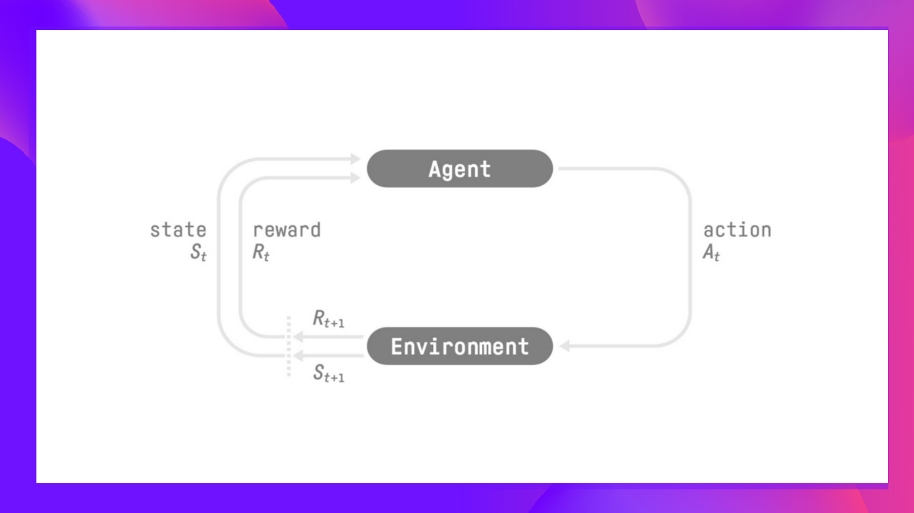
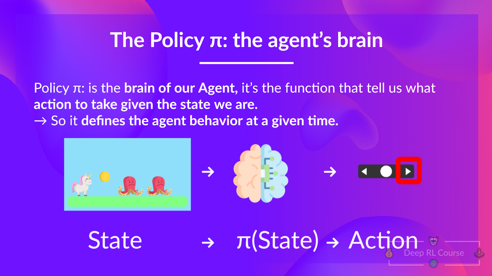
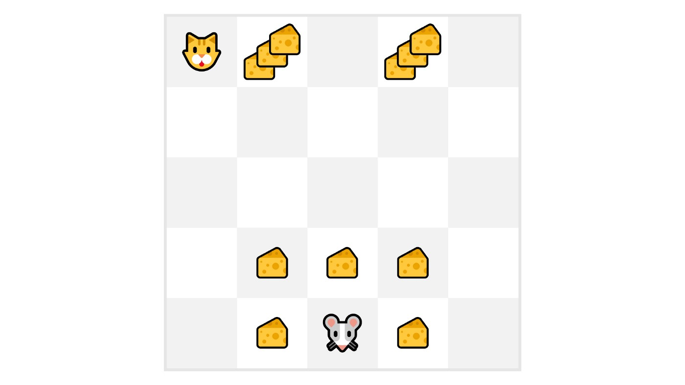
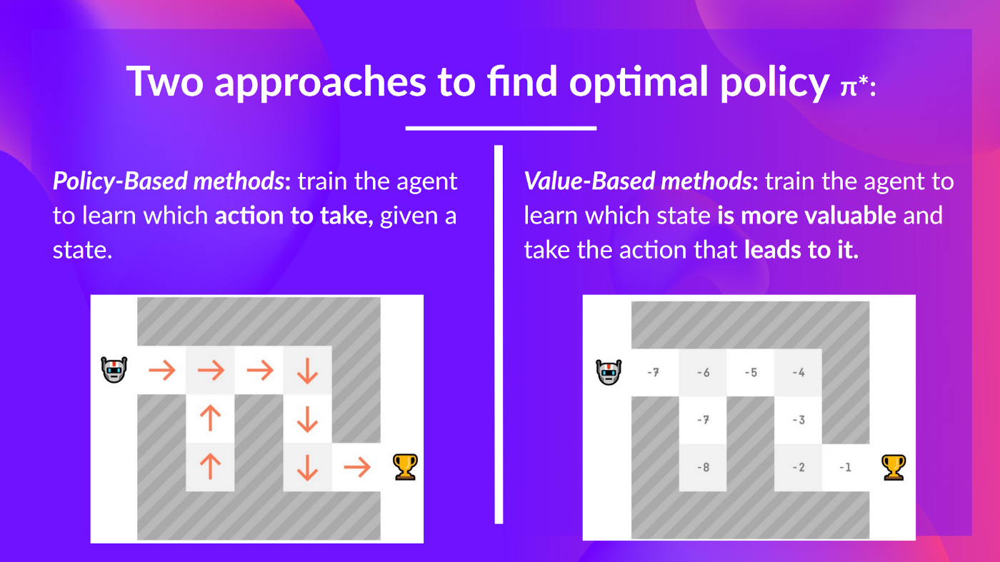

# HuggingFace Deep RL Course Notes
This post is going to be slightly different, as I am going to be using it as a sort of living document to record my notes from the [HuggingFace Deep RL Course](https://huggingface.co/course/chapter1). I will be updating this post as I work through the course, so check back often for updates!

# Unit 1: Introduction to Deep Reinforcement Learning

> **Note:** The *Deep* in Deep Reinforcement Learning refers to the use of deep neural networks to approximate the agent's policy $\pi$, value function $V$, or action-value function $Q$. We will explore these concepts in more detail in later units.

We can describe reinforcement learning at a high level via the following process:
- We have an environment $E$ that is described by a state $S$.
- We have an agent $L$ that can take actions $A$ in the environment.
- The agent receives a reward $R$ for each action it takes.
- The agent's goal is to maximize the total reward it receives.

More formally, we can say that an agent first receives an observation $s_0$ from the environment. The agent then takes an action $a_0$ based on the observation $s_0$. The environment then transitions to a new state $s_1$ and returns a reward $r_1$ to the agent. This process repeats until the agent reaches a terminal state.

We can further formalize this even further with the following definitions:

## Definitions
### Environment
An environment $E$ is a function that maps states to rewards:
$$
E: S \rightarrow R
$$

and is described by a state $s_t$ at time $t$:
$$
s_t \in S
$$

That is, given some state $s_t$, the environment $E$ will return a reward $r_t$. The environment also transitions to a new state $s_{t+1}$. This reward and observations about the new state are then provided to the agent, $L$.

### Agent
An agent $L$ is an entity that exists within and interacts with the environment $E$. Roughly speaking, the agent $L$ is the entity that is trying to solve the RL problem. The agent $L$ is described by a policy $\pi$ and takes actions $a_t$ in the environment $E$. 

More formally, the agent is described by a policy $\pi$ that maps states to actions:
$$
L: S \rightarrow A
$$

That is, given some observation about the current state $s_t$, the agent $L$ will return an action $a_t$. This choice is determined by the agent's policy $\pi$.

### Policy
A policy $\pi$ is a function that maps states to actions:
$$
\pi: S \rightarrow A
$$

That is, given some observation about the current state $s_t$, the policy $\pi$ will return an action $a_t$. This choice is determined by the agent's policy $\pi$.

### Reward
A reward $r_t$ is a scalar value that the agent receives after taking an action $a_t$:
$$
r_t \in R
$$

That is, given some action $a_t$, the agent $L$ will receive a reward $r_t$ from the environment $E$.

### Return
The return $R_t$ is the sum of the rewards that the agent receives after taking an action $a_t$:
$$
R_t = r_t + r_{t+1} + r_{t+2} + \cdots
$$

That is, given some action $a_t$, the agent $L$ will receive a reward $r_t$ from the environment $E$. The agent will then take another action $a_{t+1}$ and receive a reward $r_{t+1}$ from the environment $E$. This process repeats until the agent reaches a terminal state. The return at a given time $R_t$ is the sum of all of these rewards up to that point.

### Discounted Return
The discounted return $G_t$ is the sum of the rewards that the agent receives after taking an action $a_t$, but with each reward discounted by a factor $\gamma$:
$$
G_t = r_t + \gamma r_{t+1} + \gamma^2 r_{t+2} + \cdots
$$

That is, given some action $a_t$, the agent $L$ will receive a reward $r_t$ from the environment $E$. The agent will then take another action $a_{t+1}$ and receive a reward $r_{t+1}$ from the environment $E$. This process repeats until the agent reaches a terminal state. The return at a given time $R_t$ is the sum of all of these rewards up to that point, but with each reward discounted by a factor $\gamma$. This ensures that the more highly probable, early rewards are weighted more heavily than the less probable, later rewards, with respect to the final total return.

This idea is a little bit tricky, so we can take a look at the following figure to get a better intuition for why this needs to be done:

In this figure, we see that our agent (the mouse) has an advesary (the cat). The cat is intially positioned in the top left corner of the grid, and the mouse is positioned in the bottom middle tile. The mouse's goal is to maximize the amount of cheese it can eat over a given interval before one of the following two events occur:
- The mouse eats all of the cheese
- The cat eats the mouse

The cheese positioned closer to the mouse will need to be weighted higher than the cheese further away, because otherwise our policy might end up causing our agent to get eaten by the cat. This is because the agent will be more likely to get eaten by the cat than it is to eat the cheese further away. This is why we need to discount the rewards that are further away from the agent.

## RL-Problem: Finding the Optimal Policy
We can now describe the RL problem as finding the optimal policy $\pi^*$ that maximizes the return $R_t$:
$$
\pi^* = \underset{\pi}{\text{argmax}} \sum_{t=0}^{\infty} R_t
$$

There are two main approaches to solving this problem:
- Value-based methods
- Policy-based methods

### Value-Based Methods
Value-based methods attempt to find the optimal policy $\pi^*$ by finding the optimal value function $V^*$:
$$
V^* = \underset{\pi}{\text{argmax}} \sum_{t=0}^{\infty} R_t
$$

We will explore value-based methods in more detail in the next chapter.

### Policy-Based Methods
Policy-based methods attempt to find the optimal policy $\pi^*$ directly:
$$
\pi^* = \underset{\pi}{\text{argmax}} \sum_{t=0}^{\infty} R_t
$$

We will explore policy-based methods in more detail in later chapters, but for now we can say that policy-based methods are typically more sample efficient than value-based methods, and have become increasingly popular in recent years given the advancements in deep learning algorithms and capabilities empowered by powerful GPUs.

## Summary
In summary, we can describe reinforcement learning as the following process:
- We have an environment $E$ that is described by a state $S$.
- We have an agent $L$ that can take actions $A$ in the environment.
- The agent receives a reward $R$ for each action it takes, along with an observation about the new state.

We can state the goal of the agent as maximizing the total reward it receives.

That is, the agent's goal is to maximize the return $R_t$:
$$
R_t = r_t + r_{t+1} + r_{t+2} + \cdots
$$

Therefore *our* goal will be to find the optimal polciy $\pi^*$ that maximizes the return $R_t$:
$$
\pi^* = \underset{\pi}{\text{argmax}} \sum_{t=0}^{\infty} R_t
$$

We can solve this problem using either value-based methods or policy-based methods.

In the next unit, we will explore value-based methods in more detail through the use of Q-Learning, a popular value-based method for solving RL problems.

# Unit 2: Introduction to Q-Learning
In this unit, we will explore Q-Learning, a popular value-based method for solving RL problems.

This will involve us implementing an RL-agent from scratch, in 2 environments:
- Frozen-Lake-v1 (non-slippery version): where our agent will need to go from the starting state (S) to the goal state (G) by walking only on frozen tiles (F) and avoiding holes (H).
- An autonomous taxi: where our agent will need to learn to navigate a city to transport its passengers from point A to point B.

Pulling directly from the course material:
> Concretely, we will:
    > - Learn about value-based methods.
    > - Learn about the differences between Monte Carlo and Temporal Difference Learning.
    > - Study and implement our first RL algorithm: Q-Learning.
> This unit is fundamental if you want to be able to work on Deep Q-Learning: the first Deep RL algorithm that played Atari games and beat the human level on some of them (breakout, space invaders, etc).
>
> So let’s get started! 🚀

## Value-Based Methods

In value-based methods, we learn a value function that maps a state to the expected value of being at that state. This value function is typically denoted as $V(s)$.

Borrowing directly from HuggingFace:
>*The value of a state is the expected discounted return the agent can get if it starts at that state and then acts according to our policy.*

That is, given some state $s_t$, the value function $V(s)$ will return the expected value of being at that state.

### Two types of value-based methods
There are two types of value-based methods:
- Monte Carlo methods
- Temporal Difference methods

### Monte Carlo Methods
Monte Carlo methods are a type of value-based method that learn directly from episodes of experience. That is, Monte Carlo methods learn from complete episodes of experience, rather than step-by-step. We can more formally define Monte Carlo methods as follows:

#### References
- [HuggingFace Deep RL Course](https://huggingface.co/course/chapter1)