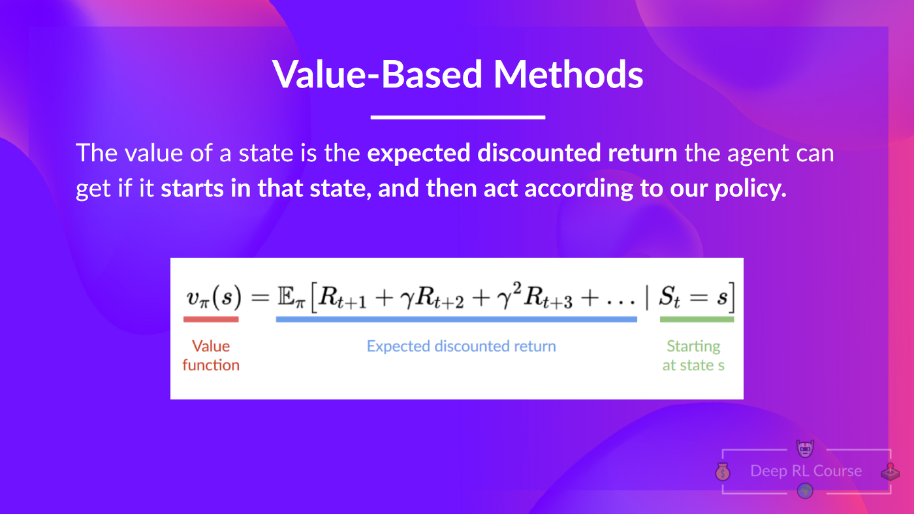

# HuggingFace Deep RL Course Notes
These post are going to be slightly different, as I am going to be using them as a sort of living document to record my notes from the [HuggingFace Deep RL Course](https://huggingface.co/learn/deep-rl-course). I will be updating this post as I work through the course, so check back often for updates!

## Unit 2: Introduction to Q-Learning
In this unit, we will explore Q-Learning, a popular value-based method for solving RL problems.

This will involve us implementing an RL-agent from scratch, in 2 environments:
- Frozen-Lake-v1 (non-slippery version): where our agent will need to go from the starting state (S) to the goal state (G) by walking only on frozen tiles (F) and avoiding holes (H).
- An autonomous taxi: where our agent will need to learn to navigate a city to transport its passengers from point A to point B.

Pulling directly from the course material:
> Concretely, we will:
    > - Learn about value-based methods.
    > - Learn about the differences between Monte Carlo and Temporal Difference Learning.
    > - Study and implement our first RL algorithm: Q-Learning.
> This unit is fundamental if you want to be able to work on Deep Q-Learning: the first Deep RL algorithm that played Atari games and beat the human level on some of them (breakout, space invaders, etc).
>
> So let’s get started! 🚀

For reference, I am including a glosarry of terms and concepts that are either introduced in this unit, or are important to restate here due to their application to the material we will be covering.

## Unit 2 - Glossary

### Two Types of Value Functions

#### State-Value Functions

$$
V^{\pi}(s) = \mathbb{E}_{\pi}[R_t | s_t = s]
$$

#### Action-Value Functions

$$
Q^{\pi}(s, a) = \mathbb{E}_{\pi}[R_t | s_t = s, a_t = a]
$$

### Optimal Policy

$$
\pi^*(s) = \text{argmax}_{a} Q^*(s, a) \quad \text{for all}\ s
$$

### Q-Learning - Update Rule

$$
Q(s, a) \leftarrow Q(s, a) + \alpha[r + \gamma \text{max}_{a'} Q(s', a') - Q(s, a)]
$$

### Epsilon Greedy Policy 

$$
\pi(a|s) = 
\begin{cases} 
1 - \epsilon + \frac{\epsilon}{|A|}, & \text{if}\ a = \text{argmax}_{a'} Q^{\pi}(s, a') \\
\frac{\epsilon}{|A|}, & \text{otherwise}
\end{cases}

$$

## Unit 2 - Content
### Value-Based Methods

In value-based methods, we learn a value function that maps a state to the expected value of being at that state. This value function is typically denoted as $V(s)$.

Borrowing directly from HuggingFace:
>*The value of a state is the expected discounted return the agent can get if it starts at that state and then acts according to our policy.*

That is, given some state $s_t$, the value function $V(s)$ will return the expected value of being at that state.

Our goal remains the same; we want to find the optimal policy $\pi^*$ that maximizes the expected return $G_t$. However, we are not doing so directly, but are instead training a model on a value function for a given state, and define the policy in terms of the value function.

From the course material:

> "In fact, most of the time, in value-based methods, you’ll use an Epsilon-Greedy Policy that handles the exploration/exploitation trade-off; we’ll talk about this when we talk about Q-Learning in the second part of this unit."

What this "Epsilon-Greedy Policy" does is that it returns 

### Two types of value-based methods

In value-based methods for finding the optimal policy, we have two types of value functions:
  - **State-Value Functions**
    - For the state-value function, we calculate the value of each state $$S_t$$,
    

    
    

    

    
    

  - **Action-Value Functions** 
    - For the action-value functions, we assign a value to each tuple $$(S_t, A_t)$$, where $$A_t$$ is the action taken between possible states.
    

    
    

    

    
    

    

The state-value functions contain less information than the action-value functions, but finding the action-value function explicitly would be much more computationally intensive. Therefore, we are going to introduce our first named equation in the course, the ***Bellman Equation***.

### Bellman Equation

#### References
- [HuggingFace Deep RL Course](https://huggingface.co/learn/deep-rl-course)